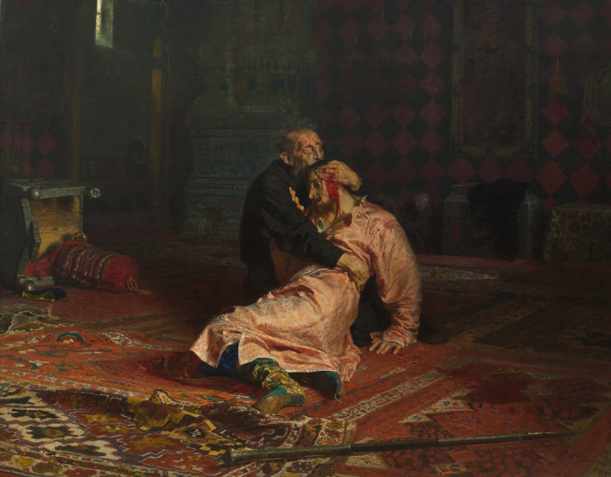

# Илья Репин и миф об убийстве сына Иваном Грозным

**Учебная дисциплина: «Основы медиаобразования»**

**Масюкова Екатерина Евгеньевна**

**2026**

# Содержание

[Введение](#intro)

[Творчество: как рождаются «фейки»](#part1)

[Образ Ивана Грозного в искусстве](#part2)

[Иван Грозный: что говорят источники XVI века](#part3)

[Политический контекст: зачем нужен был миф](#part4)

[Илья Репин: художник эпохи травмы](#part5)

[Момент создания: культурная атмосфера](#part6)

[Реакция современников: скандал как медиаэффект](#part7)

[Легенды о «проклятии» картины](#part8)

[Как миф закрепился в массовой культуре](#part9)

[Судьба полотна](#part10)

[Список использованной литературы:](#toc)

# Введение 

Перед зрителем разворачивается шокирующая сцена: царь Иван IV прижимает к груди окровавленное тело умирающего царевича. На картине Ильи Ефимовича Репина **«Иван Грозный и сын его Иван 16 ноября 1581 года»** запечатлены кровь, безумный взгляд отца и обречённое лицо наследника. Этот сильный драматический образ у многих сформировал однозначное впечатление — своего рода «доказательство» тяжкого преступления. Однако откуда в массовом сознании берётся уверенность в том, что сын действительно был убит отцом, – из летописей или из полотна?

_«Иван Грозный и сын его Иван 16 ноября 1581 года» в Государственной Третьяковской галерее_

17 декабря 2024 года Третьяковская галерея открыла выставку, которая была посвящена реставрации и возвращению в постоянную экспозицию картины Ильи Репина «Иван Грозный и сын его Иван 16 ноября 1581 года».

_Повреждённая картина «Иван Грозный и сын его Иван 16 ноября 1581 года»_

Картина на тот момент пережила уже второе покушение, оказавшись сильно повреждена 25 мая 2018 года. Один из посетителей Третьяковской галереи — 37—летний житель Воронежа Игорь Подпорин — ударил полотно металлической стойкой ограждения. _«В результате толстое стекло, защищавшее работу от колебаний температурно—влажностного режима, было разбито. <...> Холст прорван в трех местах в центральной части работы, на фигуре царевича. От падения стекла сильно пострадала авторская художественная рама»_, — [заявляла Третьяковская галерея](https://www.forbes.ru/forbeslife/362205-vtoroe-pokushenie-kak-ivan-groznyy-perezhivet-napadenie-vandala). Интерес представляет то, как вандал объяснял свой поступок. Преступник заявил, что _«картина неправильная — Иван Грозный не убивал своего сына, поэтому её нужно было порвать»_. 

_Поврежденная картина, повреждения в ультрафиолете и картина после реставрации_

Инфернальная слава работы Репина преследует её с самого момента создания: полотно пережило два покушения, запрещалось к демонстрации цензурой, сопровождалось самоубийством писателя Всеволода Гаршина, позировавшего Репину для изображения лица сына Ивана Грозного, а так же самоубийством смотрителя галереи, Егора Хруслова, после первого покушения на картину в 1913 году. 

Значимость и масштаб фигуры Ивана Грозного в истории России, невероятный талант Ильи Ефимовича Репина, контекст и череда случайностей, о которых мы подробно расскажем в этом лонгриде, создали у картины «Иван Грозный и сын его Иван 16 ноября 1581 года» образ мистического наваждения. Цель этого материала – изучить дошедшие до нас документы и научные исследования, показать, как эстетический образ превращается в «исторический факт» и отделить реальную историю от вездесущего мифа: был ли новый образ Ивана Грозного создан Репиным, или тот лишь заострил уже существующий «фейк»?

# Творчество: как рождаются «фейки» 

Исторический фейк – это условный термин: искажение действительных событий, которое широко распространяется благодаря яркому нарративу. Художественный образ часто воспринимается сильнее сухой хроники. Зрелищная картина запоминается надолго, и зритель невольно воспринимает её как свидетельство. Примером такого влияния служит картина Делакруа «Свобода, ведущая народ» (1830), которая закрепила в массовом сознании образ как «народной борьбы». 

В XX веке в России фильмы Сергея Эйзенштейна, такие как «Иван Грозный», и «Александр Невский» формировали новые представления об исторических личностях в эпоху соцреализма. Так, искусство выступает «эмоциональным архивом» эпохи: сильный образ обрастает слухами и легендами, а люди, малознакомые с первоисточниками, принимают его за факт. Именно поэтому мы будем методично сверять каждый факт с документами: используя принцип «источник—вопрос—вердикт», проверим, что известно о гибели царевича, а что – плод воображения художников и публицистов.

# Образ Ивана Грозного в искусстве 

Личность Ивана Грозного возбуждала умы многих творцов. Интерес к фигуре Грозного в русской литературе во многом был вдохновлен «Историей государства Российского» Н. М. Карамзина, который называл личность царя «славным характером для исторической живописи».

М. Ю. Лермонтов в своей знаменитой «Песня про царя Ивана Васильевича, молодого опричника и удалого купца Калашникова» (1837 г.) создаёт былинный, почти фольклорный образ царя. С одной стороны, он грозен и скор на расправу, с другой — способен оценить честность и смелость купца Калашникова.

А. К. Толстой автор обращался к эпохе Грозного чаще и глубже других. Ему принадлежит не только знаменитый роман «Князь Серебряный» (1862 г.), где царь предстает в переломный момент своей эпохи, но и драматическая трилогия, открывающаяся трагедией «Смерть Иоанна Грозного». В своих балладах 1840—х годов он одним из первых отошел от идеализации, показывая царя импульсивным и жестоким.

В советский период, особенно в годы Великой Отечественной войны и после нее, в литературе актуализируется образ сильного государственника, собирателя русских земель. В. И. Костылев — автор знаменитой трилогии «Иван Грозный» (1943—47 гг.), удостоенной Сталинской премии. Составляющие её книги «Москва в походе», «Море» и «Невская твердыня» рисуют масштабное полотно эпохи. Хотя образ царя у Костылева несколько идеализирован и его жестокость оправдывается государственной необходимостью, писатель создал сложный психологический портрет, показав царя во всем противоречии его натуры, включая трагическую сцену убийства сына. 

Образ Ивана Грозного в кино имеет не менее богатую и противоречивую историю, чем в литературе. Каждая эпоха создавала своего царя, вкладывая в него актуальные для своего времени смыслы — от мудрого правителя-собирателя до безумного тирана. Особенно можно выделить во многом противоположные образы, построенные в двух фильмах:

_«Иван Грозный» (1944 г.), реж. Сергей Эйзенштейн._

Это, без преувеличения, эталонный фильм, во многом определивший визуальный образ царя в массовом сознании. Первая серия, где Иван (Николай Черкасов) показан сильным государем, получила одобрение Сталина. 

_«Иван Грозный. Сказ второй»., реж. Сергей Эйзенштейн._

Однако вторая серия, где царь предстает мучимым сомнениями тираном, была подвергнута резкой критике и положена на полку до 1958 года, что в итоге помешало Эйзенштейну завершить планировавшуюся трилогию. С этим фильмом связано и зарождение легенды о «проклятии роли», так как вскоре смерть настигла и режиссера, и заказавшего картину Сталина, и актера, озвучивавшего Малюту.

_«Иван Васильевич меняет профессию« (1973 г.), реж. Леонид Гайдай._

Самая любимая и народная киноверсия. Царь в исполнении Юрия Яковлева — не кровожадный тиран, а обаятельный, любопытный и властный правитель, попавший в нелепые ситуации современной Москвы. Интересно, что костюмы для фильма создавала та же художница, что работала с Эйзенштейном, а сам образ Грозного у Яковлева, по мнению критиков, оказался близок к прижизненным изображениям царя.

# Иван Грозный: что говорят источники XVI века 

Иван Грозный был одной из наиболее сложных, одиозных и противоречивых личностей в истории Российского государства. Московский князь, который из отдельных разобщённых и своекорыстных княжеств создал единое мощное государство. Полководец, который возвеличил военную славу России на востоке и западе. Государь, который для решения этих великих задач впервые возложил на себя венец — Царя Всея Руси.

_Страницы «Хронографа» – одного из памятников древнерусской письменности_

Наследник его Иоанн Иванович скончался 19 ноября 1581 года в Александровской слободе. В царской переписке этого времени нет однозначного признания убийства. В особой грамоте, найденной Н. Лихачёвым, царь Иван IV сообщает своим доверенным лицам, что _«Иван, сын разнемогся и нынече, конечно, болен… ехати отсюда невозможно»_. То есть отец сам говорил о болезни сына. Тем не менее слухи о насильственной смерти сына гуляли уже при жизни царя: в «Хронографе» 1617 года упоминается, что царевич _«от отца своего ярости прияти ему болезнь, а от болезни же и смерть»_. Мазуринский летописец дополняет: _«убит был посохом»_. Иезуит Антонио Поссевино, посетивший Москву вскоре после событий, подробно описал ссору: ударив беременную невестку, царь затем поразил и сына посохом по голове. Как утверждает Поссевино, _«Князь ударил ее по лицу, а затем так избил своим посохом, бывшим при нем, что на следующую ночь она выкинула мальчика. В это время к отцу вбежал сын Иван и стал просить не избивать его супруги, но этим только обратил на себя гнев и удары отца. Он был очень тяжело ранен в голову, почти в висок, <…> а спустя несколько дней умер»_. Английский посланник Джером Горсей сообщил, что в приступе гнева государь дал наследнику _«по́щечину»_, после которой у царевича поднялась «жаркая болезнь» и он скончался через три дня, а голландский купец Исаак Масса также пишет, что царь «ударил сына посохом по голове, что тот через три дня скончался».

_Антонио Поссевино_

Однако ни у Поссевино, ни у западных хронистов нет существенной ссылки на архивные письма или дневники бояр (записи послов часто полны литературных приукрашиваний). Во всех русских летописях XVI в. фигурирует только факт кончины царевича, а о насилии упоминается весьма скудно. Во «Временнике» дьяка Ивана Тимофеева косвенно говорится: «некоторые говорят, что жизнь его угасла от удара руки отца, за то, что он хотел удержать отца от некоторого неблаговидного поступка». В Псковской летописи отмечено, что в 1580 г. отец «поколол остием» сына, когда царевич предлагал свой план войны – но это событие годом раньше и без трагических последствий. Во многих памятниках того времени гибель описывается кратко или вовсе как «умирание от болезни».

Археологические исследования XX века также не дали «доказательств» убийства. В 1960—х годах при работах в Архангельском приделе Кремля производилась антропологическая работа и реконструкция облика Ивана IV и некоторых членов его семьи (работы М. М. Герасимова и других исследователей). Публикации об итогах вскрытий отмечают: череп царевича частично разрушен — интерпретации этого факта различаются; также упоминалось повышенное содержание ртути в костях, что может быть свидетельством наличия ртути в лекарственных препаратах того времени, а чёткие указатели на отравление отсутствуют. Прямых «хирургических» доказательств археология не дала — ни полного подтверждения, ни окончательного опровержения версии об убийстве. 

_М.М. Герасимов. Скульптурный портрет Ивана Грозного. 1965_

В 1963 г. советские антропологи впервые вскрыли гробницы Ивана IV и его детей. На костях самого Ивана и Фёдора не было найдено признаков ударов или переломов. Череп же царевича оказался полностью разрушенным, что однозначно объяснить невозможно. В резюме экспертов сказано, что следы вездесущих ртутных или мышьяковых соединений (применявшихся в медицине того времени) не позволяют однозначно утверждать отравление. Таким образом версия о преднамеренном убийстве царевича пока остаётся гипотезой: прямых доказательств тому нет. Более вероятны бытовые причины – сильный стресс от семейных драм опричнины, травмы от падений или болезни (в XVI в. эпидемии различных недугов были часты). 

 

_М.М. Герасимов. Скульптурный портрет Федора Ивановича. 1965._

# Политический контекст: зачем нужен был миф 

Смерть царевича Ивана Ивановича в 1581 году стала одним из факторов надвигавшегося на Россию затяжного династического кризиса. Без этого события вряд ли произошло бы пресечение царской династии, а значит, не было бы и Смуты начала XVII века, череды самозванцев и интервенций. 

Европейские хроники уже при жизни царя писали о нём как о варваре. Обвинения в «ужасах беззакония» нужно было обосновывать, чтобы оправдать вторжение Речи Посполитой и показать «оголтелую дикость русского царя». По мнению митрополита Иоанна (Снычева), Карамзин и другие историки XIX в. «отдавали дань русофобской риторике», тиражируя чужие враждебные картинки времен Грозного. Миф о сыноубийстве – лишь одна из таких «страшилок», удобно рисующая Ивана злодеем. Цель была двойная: и запугать внутреннюю публику («видите, наш царь хуже инквизитора»), и преподнести урок иностранцам («русский царь безбожен и коварен»). Этот негативный образ формировался задолго до Репина: у «тёмного царя» был колоритный грим в европейском восприятии ещё с XVI века, и наше кино и литература XIX–XX веков лишь наследовали его.

# Илья Репин: художник эпохи травмы 

Репин работал над картиной в переломные для России 1880—е. Он застал казнь народовольцев после убийства Александра II (1 марта 1881) и почувствовал «кровавую полосу» в истории. В автобиографических записках он признавался: «Чувства были перегружены ужасами современности… Естественно было искать выхода наболевшего в истории».

В 1883 году художник побывал на выставках в Европе и заметил: кровавые картины «творят магнетическое воздействие на зрителей». Он писал: «Несчастья, живая смерть, убийства и кровь составляют такую влекущую к себе силу, <…> и я, заразившись этой «кровавостью», по приезде домой сразу принялся за кровавую сцену “Иван Грозный с сыном”». 

  
_Иван Грозный и сын его Иван 16 ноября 1581 года. Эскиз Ильи Репина. 1883, 1899 годы 
Государственная Третьяковская галерея_
Репин был увлечён психологической драмой, корнями в народнических идеалах и декадансе своего времени. Для него изображение разрыва между царём и сыном – не буквально «историческая реконструкция», а метафора абсолютной власти, вины и трагедии: в будущем революция унаследует формулу «царь убивает сына» как символ зла и преступлений режима. Именно эмоция конфликта с современностью, а не стремление к подлинности, определяла живопись Репина.

# Момент создания: культурная атмосфера 

Конец XIX века в России сопровождался интересом к мистике, психологии и гнетущей символике. В 1880–1890—е годы символисты и декаденты писали о раздвоении личности, фатальном роке и страсти к самоистязанию. В психологии распространялись идеи «боли во имя великих целей» (концепции Льва Толстого, Флоренского, Жаботинского). В Европе тогда вышел роман «Портрет Дориана Грея» Оскара Уайльда (1890), ещё даже до появления Фрейда с идеями о бессознательном – и всё это создавало фон обречённости и «одержимости». В таком культурном контексте сцена царя, разрываемого чувством вины, воспринималась как глубоко современная. Репин вдохновлялся декором сумрачных европейских батальных картин, но выполнил свою версию по-русски: показал трагедию отца и сына, разрываемых трагическим долгом.

Таким образом картина стала не столько иллюстрацией фактов XVI века, сколько отражением (и предостережением) эпохи политических убийств и утраты стабильности конца века XIX.

# Реакция современников: скандал как медиаэффект 

Когда в феврале 1885 года Репин впервые показал картину на XIII Передвижной выставке, публики пришло так много, что у дверей выставочного зала пришлось выставить гвардейцев.
Контекст был недобрым: память о терроре 1881 года была ещё свежа, и зрители видели в картине явные аллюзии на гибель Александра II и атмосферу революции. Но власть увидела не аналогию, а угрозу. 15 февраля 1885 г. Обер-прокурор Синода К.П. Победоносцев писал Александру III: «Удивительное ныне художество — без малейших идеалов <…> Эта его картина просто отвратительна. Нельзя назвать картину исторической, так как этот момент <…> чисто фантастический, а не исторический».

  
Уведомление московского обер-полицмейстера от 2 апреля 1885 года (запрет выставляться)
Эмоциональную реакцию и критиков передал художник Суриков: по его словам, «вон у Репина на "Иоанне Грозном" сгусток крови, черный, липкий... Ведь это он только для страху. Она ведь широкой струей течет – алой, светлой. Это только через час она так застыть может». Но зрители больше боялись текущих реалий, чем авторских фантазий. Власти быстро ограничили показ. По высочайшему повелению полотно запретили к провинциальному показу – это было первое в истории живопись под цензурным прицелом. Однако уже через три месяца запрет сняли. Скандал разгорелся мгновенно: картина стала медийным событием, обсуждали её в газетах и литературе, именно тогда образ «сыноубийства» окончательно вошёл в светское пространство.

# Легенды о «проклятии» картины 

  
_Портрет В. М Гаршина. 1883. Этюд.
Государственная Третьяковская галерея_
После выставки вокруг полотна стали ходить мистические истории. Говорили даже о «проклятье» картины: натурщик царевича, писатель Всеволод Гаршин, через несколько лет действительно покончил с собой в 1888 г., однако в разные годы несколько его ближайших родственников также совершили самоубийство, что можно объяснить не мистикой, а наследственными психическими заболеваниями. Также приписывают мистические случаи композитору Модесту Мусоргскому, художнику Василию Мясоедову и другим, якобы их кончина была связана с работой с Репиным. Но документальных подтверждений этим слухам нет: как правило, информация о «проклятье» распространяется устно или в более поздних интерпретациях, без конкретных источников. 

  
_Экспозиция Третьяковской галереи. Зал № 8 с картинами И. Репина. 1902.
Государственная Третьяковская галерея_

Зато известны реальные атаки на картину. В 1913 году старообрядческий иконописец Абрам Балашов, крича «Довольно смертей, довольно крови!», трижды ударил ножом полотно, рассек на нём лик царя. Балашова отправили на месяц в психбольницу, и был признан невменяемым. После этого случая, хранитель музея Егор Хруслов покончил с собой, бросившись под поезд. Российские газеты бурно обсуждали поступок Балашова. Поэт Максимилиан Волошин оправдывал его, называя жертвой и призывал ограничить доступ к картине. Саму её отреставрировали примерно за месяц, хотя сразу после происшествия художник Репин сильно переживал и сомневался в возможности восстановления своего произведения. 

В декабре 2018 года к картине было предпринято второе покушение. Инженер Игорь Подпорин разбил стекло, защищающее картину, металлической стойкой ограждения, объяснив свой поступок властям тем, что «Даже Путин по телевизору говорил: то, что на ней - неправда. И Иван Грозный же - святой. В книгах написано. Года два я уже про это думаю. И тут вот пришел в «Третьяковку» и не смог сдержаться. Очень меня возмутила картина этого Репина. Иностранцы же туда ходят, увидят такое и что они про нашего русского царя подумают? И про нас? Это провокация против русского народа, чтобы к нам плохо относились.»

Таким образом факты таковы: все легенды о «несчастьях» лишены под собой оснований, и по сути совпадают с мифом о «проклятии», ходящим в СМИ, а имевшие место в реальности события, могут быть объяснены логико-фактологически, а не мистикой. 

Легенда о «высохшей руке Репина» тоже не совсем верна: у него развилась органическая неврологическая болезнь правой кисти (описанная в медицинских исследованиях как _компрессионно-ишемическая нейропатия правого локтевого нерва_), после чего художник частично переучился работать левой рукой и использовал приспособления для палитры. На основе современных клинико-анатомических исследований и исторических материалов это объясняется болезнью, переутомлением и иными органическими причинами.

# Как миф закрепился в массовой культуре 

Образ «сыноубийцы» полюбился публике. Даже в советских учебниках Иван упоминался как тиран, «рубивший головы» за малейшие провинности. В художественных и детективных книгах XIX–XX веков он неизменно представлен кровожадным деспотом. Популярные фильмы (от легендарной дилогии «Иван Грозный» С.М. Эйзенште́йна до многочисленных фильмов про Бориса Годунова) не упускали этот сюжет. Полотно Репина «в народе» привыкли называть «Иван Грозный убивает сына» – оно неотделимо от коллективной памяти. И в журналистике периодически появляются «расследования», которые берут за факт то, что показано на картине. Одни материалы разоблачают «фейк», другие героизируют репинский образ. Но важно помнить: та самая «доказательная визуализация», которой восхищались толпы на выставке и обсуждали богословы, по сути выросла из комбинации старых легенд и художественной гипотезы.

# Судьба полотна 

После выставки картина долго находилась в хранилище Третьяковки. Лишь в начале XX века её впервые открыто экранизировали штрихами: в январе 1913 г. Репин сам прилетел из Петербурга, чтобы восстановить полотно после ножевых порезов Балашова. В советское время оно хранилось в запасниках, демонстрироваться официально его долго не хотели. Лишь во второй половине XX века полотно (наряду с этюдами) стало доступно зрителям. После реставрации 2022–2024 гг. картина вернулась в постоянную экспозицию Третьяковки в декабре 2024 года. На сегодняшний день картина «Иван Грозный и сын его Иван…» окружена стеклом и камерами.

Что сильнее — документ или изображение? Читатель уже знает главное: версия о сыноубийстве так и остается спорной, документы неоднозначны, археология не даёт однозначных доказательств насильственной смерти. Миф долгие годы подпитывали народные легенды и разрозненность исторических свидетельств, а картина только усилила этот нарратив. Можно задаться вопросом: если бы Репин изобразил не «убийство», а «болезнь царевича», поверили бы мы в убийство? Вряд ли. Сила искусства в том, что гипотезу, высказанную художником для создания эмоционального отклика у публики, та восприняла как окончательный факт. И именно через повторение красивого визуального образа «фальсификация» вошла в народную память. Таким образом репинский портрет не является изображением действительного убийства, но демонстрацией: привычный «исторический фейк» рождается не от злого умысла, а от художественной метафоры, которая множится в умах и книгах как неоспоримый «документ».

# Список использованной литературы: 

1.	Поссевино, А. Исторические сочинения о России XVI в. / А. Поссевино. — М.: Издательство Московского университета, 1983. — 272 с.
2.	Горсей, Дж. Записки о Московии XVI века / Дж. Горсей. — СПб: Издательство фонда поддержки науки и образования «Университет», 2020. — 288 с.
3.	Масса, И. Краткое известие о начале и происхождении современных войн и смут в Московии / И. Масса // О начале войн и смут в Московии. — М.: Фонд Сергея Дубова, 1997. — С. 15–164.
4.	Лихачев, Н. П. Дело о приезде в Москву Антония Поссевино / Н. П. Лихачев. — Санкт-Петербург: Типография В. С. Балашева, 1903. — 211 с.
Археологические исследования и антропология
5.	Герасимов, М. М. Документальный портрет Ивана Грозного / М. М. Герасимов // Краткие сообщения Института археологии. — 1965. — Вып. 100. — С. 139–142.
6.	Герасимов, М. М., Герасимова, К. М. / Михаил Герасимов: я ищу лица. О восстановлении внешнего облика исторических лиц. М.: Наука, 2007
7.	Никитин, С. А. Антропологическая реконструкция облика исторических лиц: методика и практика / С. А. Никитин. — М.: Институт этнологии и антропологии РАН, 2019. — 184 с.
8.	Карамзин, Н. М. История государства Российского. В 12 т. Т. 9 / Н. М. Карамзин. — М.: Наука, 1991. — 256 с.
9.	Ключевский, В. О. Курс русской истории. В 9 т. Т. 2 / В. О. Ключевский. — М.: Мысль, 1988. — 447 с.
10.	Костомаров, Н. И. Русская история в жизнеописаниях ее главнейших деятелей / Н. И. Костомаров. — М.: Эксмо, 2021. — 1024 с.
11.	Толстой, А. К. Князь Серебряный / А. К. Толстой. — М.: Художественная литература, 1986. — 320 с.
12.	Толстой, А. К. Смерть Иоанна Грозного / А. К. Толстой // Драматическая трилогия. — СПб: Наука, 2018. — С. 7–138.
13.	Костылев, В. И. Иван Грозный. В 3 кн. / В. И. Костылев. — М.: Вече, 2019. — 1152 с.
14.	Эйзенштейн, С. М. Иван Грозный / С. М. Эйзенштейн // Избранные произведения. В 6 т. Т. 1. — М.: Искусство, 1964. — С. 169–366.
15.	Репин, И. Е. Далекое близкое / И. Е. Репин. — М.: Академия художеств СССР, 1960. — 512 с.
16.	Грабарь, И. Э. Репин / И. Э. Грабарь. — М.: Издательство Академии наук СССР, 1963. — 332 с. — (Монография в 2 т.).
17.	Лясковская, О. А. Илья Ефимович Репин / О. А. Лясковская. — М.: Терра, 2003. — 480 с.
18.	Пророкова, С. А. Репин / С. А. Пророкова. — М.: Молодая гвардия, 1960. — 416 с. — (Жизнь замечательных людей).Волошин, М. А. О смысле катастрофы, постигшей картину Репина / М. А. Волошин // Лики творчества. — Ленинград: Наука, 1988. — С. 512–517.
19.	Юденкова, Т. В. «Иван Грозный и сын его Иван» Ильи Репина. К истории создания и бытования / Т. В. Юденкова // Третьяковские чтения. 2010–2011. — М.: ГТГ, 2012. — С. 176–
20.	Снычев, И. (митрополит). Самодержавие духа / И. Снычев. — Санкт-Петербург: Царское дело, 1995. — 496 с.
21.	Горожанин, А. В. Федяков, А. Г., Ловягина, В. Е. Дифференциальный диагноз болезни великого русского художника И.Е. Репина // Нервно—мышечные болезни. 2024. №4. URL: https://cyberleninka.ru/article/n/differentsialnyy—diagnoz—bolezni—velikogo—russkogo—hudozhnika—i—e—repina .

